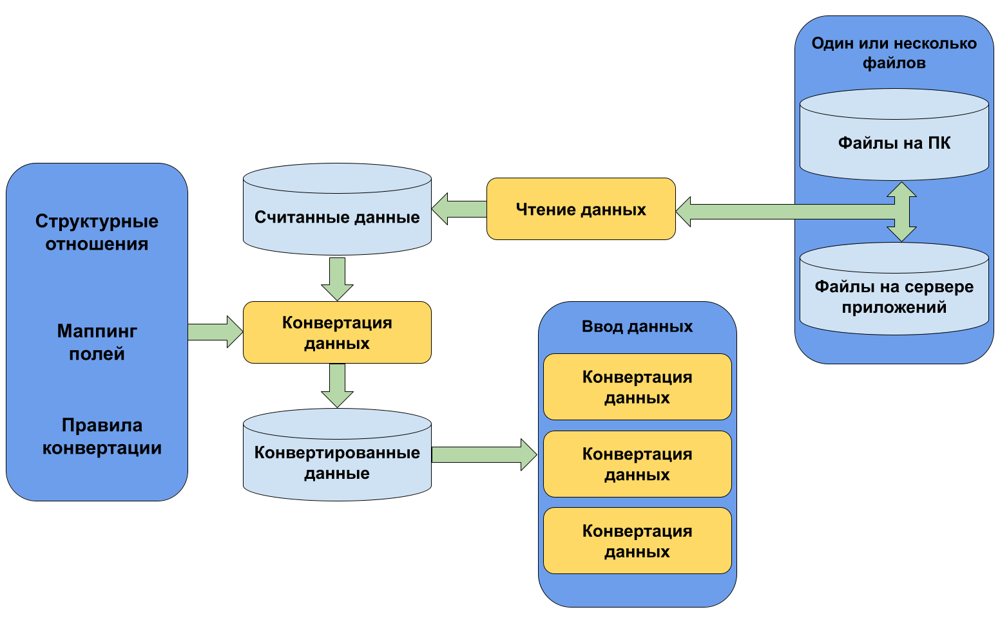
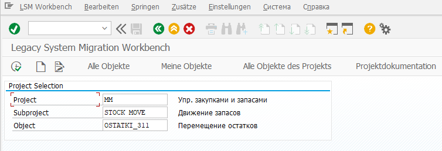

LSMW – это инструмент для переноса из исторической системы в SAP. Часто LSMW используется как инструмент массового ввода. Данные могут быть введены с помощью Batch Input, Direct Input, BAPIs или IDocs.

## Принцип работы LSMW



## Основные функции LSMW

* Импорт данных (данные из файлов, электронных таблиц).
* Преобразование данных в необходимый формат.
* Импорт данных в SAP систему.

## Преимущества

* LSMW – часть SAP системы не зависимая от платформы
* Большое количество возможностей по преобразованию данных
* Поддержка основных технологий ввода: Bath Input, Direct Input, BAPIs, IDocs.
* Удобный путеводитель по миграции данных
* Является бесплатным инструментом для партнеров SAP


## Перед использованием LSMW:

* Убедитесь, что SAP система окончательно настроена и готова к вводу
* Решите, имеет ли смысл использовать инструмент, его использование оправдано на больших объемах данных. Скорость импорта для режима Direct Input и Bath Input примерно 10000 записей в час, величина может меняться в зависимости от аппаратной части сервера.
* Определитесь с транзакциями в SAP системе, через которые будете выполнять импорт данных.  Созданы ли стандартные объекты Direct Input, Batch Input, есть ли необходимые BAPI.
* Протестируйте выбранные транзакции вручную, определите, какие поля являются обязательными к заполнению.
* Учтите, что LSMW не извлекает данные из внешних систем, их необходимо предварительно подготовить. Формат файла должен соответствовать возможностям чтения файлов LSMW. Например: кодировка должна быть либо ASCII или IBM.
* Определитесь с методом импорта данных (BAPI, Direct Input и т.п.).

## Предварительная настройка

Убедитесь что у пользователя, под которым будет происходить импорт, достаточные полномочия:

Уровень авторизации | Профиль | Функции
--------------------|---------|--------
Просмотр | B_LSMW_SHOW | Пользователю разрешается просматривать все проекты LSMW
Выполнение | B_LSMW_EXEC | Пользователь может выполнять и редактировать шаги проектов
Изменение | B_LSMW_CHG | Пользователь обладает полномочиями на просмотр объекта LSMW, импорт и чтение данных.
Администрирование | B_LSMW_ALL | Все полномочия на LSMW

# Запуск

Для начала работы запустите тразакцию ```LSMW``` .



Тут:

* Project – имя проекта, например «Упр. закупками и запасами»
* Subproject – имя подпроекта, например «Движение запасов»
* Object – имя объекта LSMW который включает все операции по переносу данных, например «Перемещение остатков».

С помощью кнопок на начальном экране можно:

* Запустить проект на выполнение
* Создать новый проект, объект
* Изменить проект
* Просмотреть все объекты LSMW в системе
* Просмотреть все свои объекты
* Просмотреть все объекты к проекту
* Изменить документацию к проекту

## Администрирование

Для копирования, изменения, удаления объектов, проектов и подпроектов необходимо перейти в администрирование: _Go to -> Administration._
