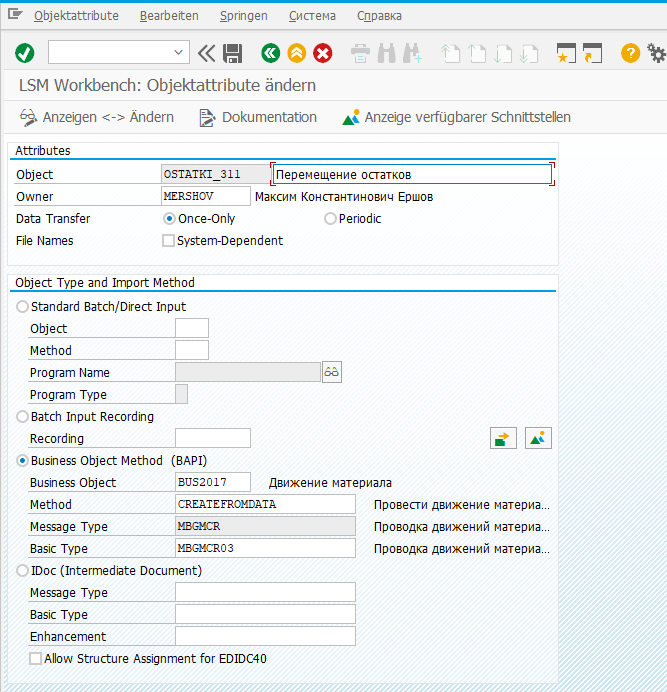

# Определение атрибута объекта

### Правила импорта данных:

* Once-Only: однократно.
* Periodic: с периодичностью (необходимо настроить шаг Frame Program for Periodic Data Transfer).

### Режимы импорта данных:

* Standard/ Batch Input: заранее подготовленные программы.
* Batch Input Recording:  ранее созданная запись пакетного ввода.
* BAPI:  использование методов бизнес объектов (BAPI).
* IDOC: использование любых функциональных модулей Inbound IDOC.
