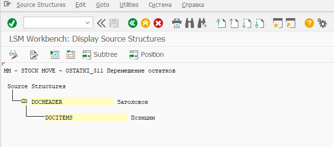

# Определение пользовательских структур

На данном шаге определяются имена пользовательских структур их описания и иерархия. Одна структура может включать несколько других, которые в свою очередь могут включать другие и т.д. Пользовательская структура заполняется из внешних данных, после чего используется для переноса данных в SAP систему.

