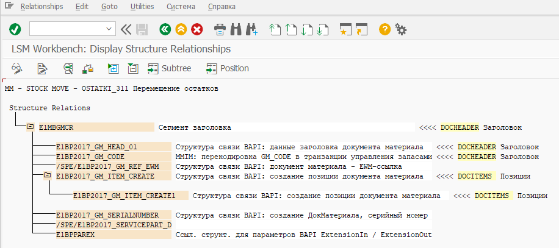

# Определение связей структур

На данном шаге определяется связь между структурами объекта импорта (Поля в структурах BAPI, поля для пакетного ввода и т.п.) и пользовательскими структурами. В приведенном выше примере структуры из пакетного ввода: BGR00, BKN00, BKNA1, BKNB1 будут заполнены из пользовательской структуры CUSTOMER_HEADER, структура BKNVK из CUSTOMER_CONTACTS. Обратите внимание на то, что многие программы пакетного ввода содержат структуры BGR00 и BI000, они должны быть заполнены всегда.

