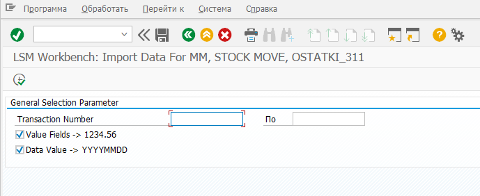

# Чтение данных

На данном шаге определяется количество записей, которые необходимо считать (Transaction Number).  Если при определении полей структуры было указано что поле должно показываться на экране выбора чтения/конвертации данных, так же его необходимо заполнить. Так же задаются правила для преобразования чисел и дат.

