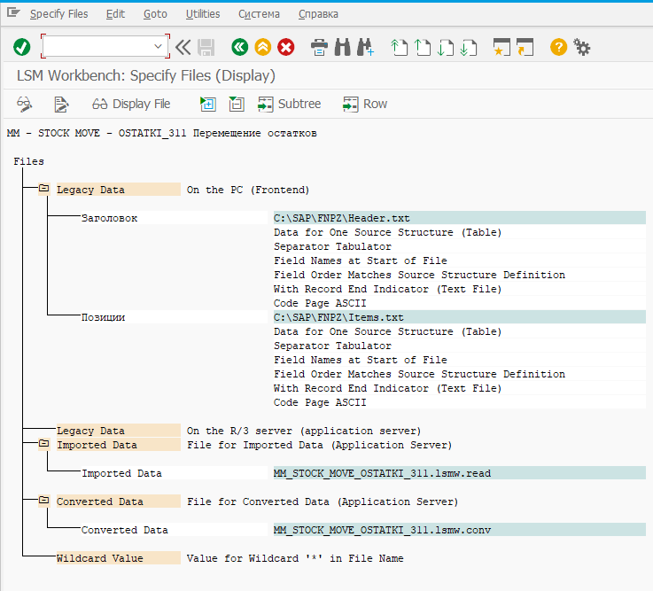
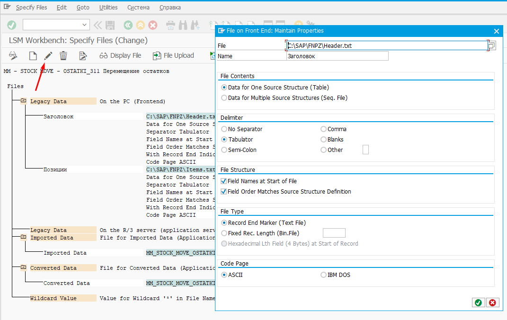

# Определение файлов

На данном шаге определяются файлы:

* С вашими данными (Legacy Data)
* Файл с правилами чтения данных …lsmw.read ставится автоматически
* Файл с правилами преобразования данных …lsmw.conv ставится автоматически

При присвоении файла с данными можно выбрать:

* Находится ли в файле содержимое одной структуры, либо файл содержит несколько структур (Data for one source structure или Data for multiple source structures)
* Определить разделители в файле между полями (; tab и др.)
* Содержит ли файл названия полей (Field names at start of file, необходимо чтобы имена совпадали с именами в пользовательской структуре)
* Совпадает ли порядок полей в файле с порядком в пользовательской структуре (Field Order Matches Source Structure Definition)
* Тип файла (Текстовый, бинарный) и кодовая страница по умолчанию (ASCII или IBM).

